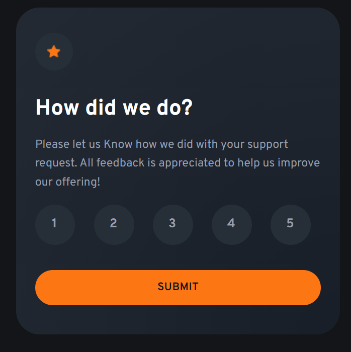
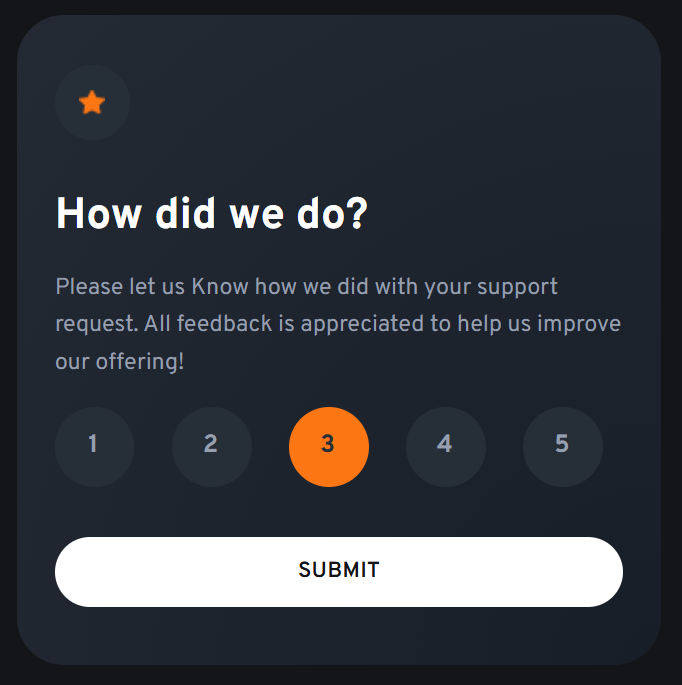
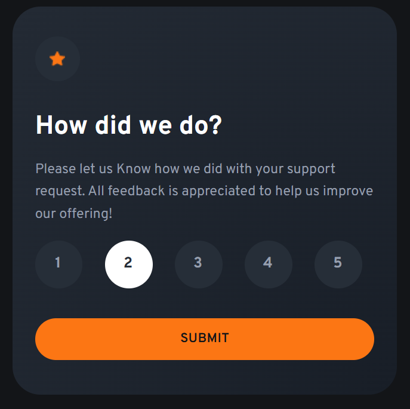
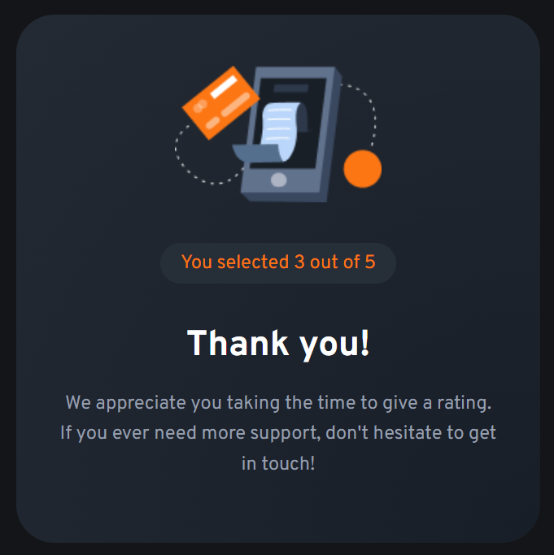

# 📌 Interactive Rating Component

## 📝 Descripción
Este proyecto es un reto de **Frontend Mentor** donde se construye un componente de calificación interactivo. El usuario puede seleccionar un número del **1 al 5** y, al enviar la calificación, se muestra una pantalla de agradecimiento con el valor seleccionado.

El componente maneja estados visuales (normal, hover, seleccionado) y un cambio de vista dinámico utilizando **React y hooks**. El diseño es totalmente **responsive**.

---

## 📸 Capturas de pantalla

### 🟢 Estado inicial

### 🟠 Estado activo

### 🔵 Estado seleccionado

### 🙌 Vista Thank You

---

## 🛠 Tecnologías utilizadas
- HTML5
- CSS3
- JavaScript
- React
- Vite
- Tailwind CSS

---

## 🚀 Retos
- Manejar el estado de la calificación y compartirlo entre componentes usando props.
- Controlar el renderizado condicional para alternar entre la tarjeta de rating y la vista de agradecimiento.
- Aplicar estilos dinámicos dependiendo del estado seleccionado.
- Mantener el diseño fiel al reto original y hacerlo responsive.

---

## 📚 Aprendizajes
- Mejor comprensión del flujo de datos en React usando `useState`.
- Separación de responsabilidades mediante componentes reutilizables.
- Uso práctico de Tailwind CSS para manejar estados visuales y responsive design.
- Validación básica antes de permitir el envío del formulario.

---

## 👨‍💻 Autor
**Jesus Anguiano**  
GitHub: https://github.com/AnguiNator
